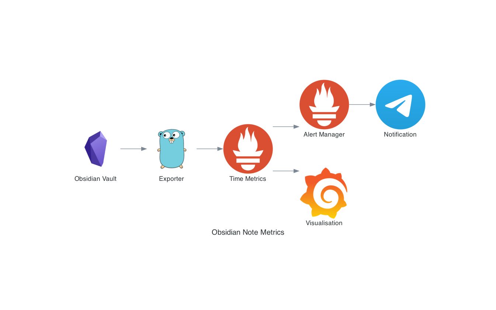

# Obisidian Note Metrics

Proof of concept for monitoring and alerting on metrics from your Obsidian Vault[^1]

The exporter looks for a particular `tag` in your markdown files and exposes that as a prometheus gauge.

This can then be consumed by prometheus, visualised with grafana and notifications provided
by alert manager. 

The example uses telegram for notifications but it would be easy enough to use another notification method.



This repository uses Taskfile as a build helper. Run `task -l` to see available tasks.

## Building the exporter

Using Taskfile:

```bash
task build
```

Without:

```bash
go build -o obsidian-exporter -v main.go
```

## Usage/Examples

```bash
➜  ./main -h
Usage of ./obsidian-exporter:
  -listen-address string
        The address to listen on for HTTP requests. (default ":8090")
  -tag string
        tag to check for (default "#unprocessed")
  -vault-collection string
        location of your files to check (default "./")
```

Running the exporter and passing through a vault location:

```
./obsidian-exporter -vault-collection "/Users/$USER/Documents/personal-notes"
```

## Example with local prometheus and alert manager

clone the repo and build the exporter:

```
git clone 
task build
```

run the exporter:

```
./obsidian-exporter -vault-collection "/Users/$USER/Documents/personal-notes"
```

### Alerting with Telegram

To notify Telegram a bot token and chat ID need to go into a file for alertmanager to consume. This example
uses a 1password template in `example/alertmanager/alertmanager.yml.tpl`

Tune alert.yml to alert on the total number of unprocessed notes, the [default set in the example](example/prometheus/alert.yml) alerts on greater than 8 unprocessed notes

```
 `expr: total_unprocessed_notes > 8`

```

### Run docker compose

```
task example:up
```

## Authors

* [@markopolo123](https://www.github.com/markopolo123)

[^1]: Actually, this doesn't need Obsidian to work. It'll work on any folder with Markdown files in (as long as they have tags in them)
